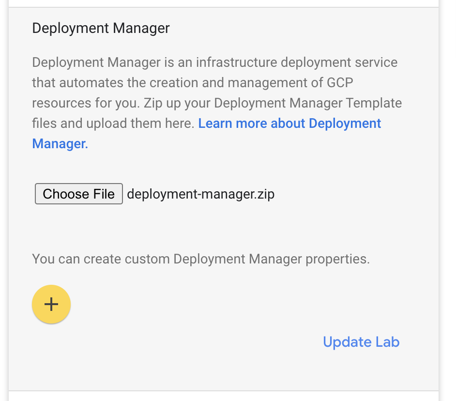

# Lab Deployment Manager

This repo has the configuration for a Qwiklabs deployment manager that can be re-used across
multiple labs. 

## How it works

The idea is that you create a lab in a separate git repo, and this deployment
manager will clone your lab's repo, and then run a startup script.

The deployment manager expects your lab to contain a script called `startup.sh` at the top level.

## How to build it

To build the deployment manager, run the script:
```shell script
./build.sh LAB_REPO LAB_BRANCH
```

e.g.
```shell script
./build.sh git@github.com:apigee-sme-academy-internal/app-modernization-lab-2.git master 
```

This creates a zip file called `deployment-manager.zip` within the `./build` output directory.

If your lab requires a private key to clone the lab's repo, you need provide the private key to the build script:

```shell script
build.sh LAB_REPO LAB_BRANCH ./path/to/private.key
```

e.g.
```shell script
./build.sh git@github.com:apigee-sme-academy-internal/app-modernization-lab-2.git master ~/deploy-keys/lab2
```

If you do not provide a private key, then an ephemeral key gets generated during the build process.

### How to use it

To use the deployment manager, you have to go on the Qwiklabs UI, and edit your lab.

<p align="center">
  
</p>

In the main lab settings, click on the deployment manager section, and upload the `deployment-manager.zip` file.


### Environment

When your lab's `startup.sh` script runs, the deployment manager has already setup a few things in the
environment to make things easy for you. 

The following tools/scripts are made available in the path:

* **rewind.sh** - for creating an Apigee Hybrid Cluster
* **git** - for cloning other repos
* **jq** - for parsing and extracting data from JSON files)
* **gcloud** - already logged in, full access to the GCP project
* **node** - v12, for running your own Node.js scripts
* **kubectl** - for accessing gke clusters
* **mvn** - v3, for deploying Apigee proxies
* **java** - v11, for use by maven

Also, the following environment variables are available:

* **LAB_DIR** - Directory for your lab
* **$ZONE** - Zone for the GCP project
* **$REGION** - Region for the GCP project
* **$PROJECT** - Name of the GCP project
* **$QWIKLAB_USER** - Username for the qwiklab student
* **$QWIKLAB_PASSWORD** - Password for the qwiklab student
